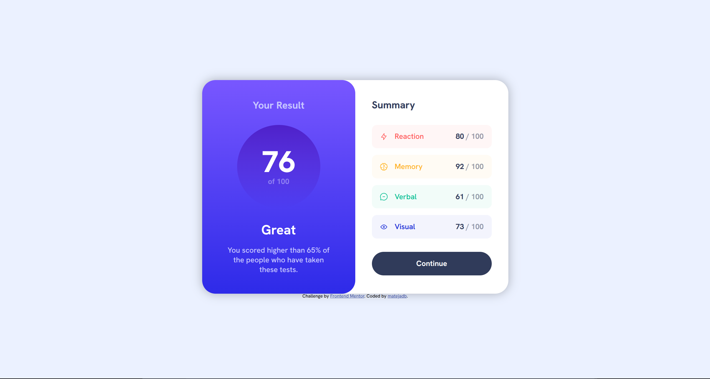

# Frontend Mentor - Results Summary Component Solution

This is a solution to the [Results summary component challenge on Frontend Mentor](https://www.frontendmentor.io/challenges/results-summary-component-CE_K6s0maV). Frontend Mentor challenges help you improve your coding skills by building realistic projects.

## Table of contents

- [Overview](#overview)
  - [The challenge](#the-challenge)
  - [Screenshot](#screenshot)
  - [Links](#links)
- [My process](#my-process)
  - [Built with](#built-with)
  - [Continued development](#continued-development)
- [Author](#author)

## Overview

### The challenge

Users should be able to:

- View the optimal layout for the interface depending on their device's screen size
- See hover and focus states for all interactive elements on the page

### Screenshot

### Links

- Solution URL: [https://github.com/matejadb/results-summary](https://github.com/matejadb/results-summary)
- Live Demo: [https://summary-results-project.netlify.app/](https://summary-results-project.netlify.app/)

## My process

### Built with

- Semantic HTML5 markup
- CSS custom properties
- Flexbox
- CSS Grid
- Responsive design using a desktop-first approach

### What i learned

This was my first time using Figma to translate a design into code. It took a bit of practice, but it helped me better understand layout structure and spacing.

### Continued development

I plan to revisit this project to optimize the code and explore adding new features, such as making the data dynamic and enhancing interactivity.

## Author

- Frontend Mentor - [@matejadb](https://www.frontendmentor.io/profile/matejadb)
- GitHub - [@matejadb](https://github.com/matejadb)
